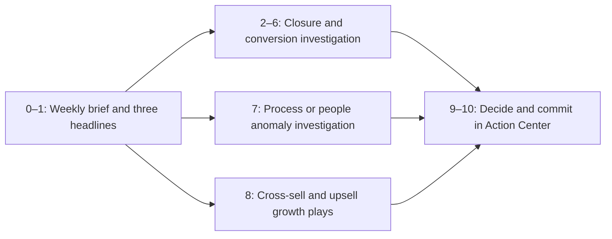

# Executive Journey and Use-Case Coverage

## Purpose

This document maps executive journey points **0–10** to the screens, evidence, and decisions implemented in NTT Command Centre. It also identifies where the three primary use cases appear:

1. Deal Closure Model
2. Cross-Sell / Upsell
3. Client Anomaly

The Executive experience uses five focused tabs instead of eleven separate pages. Several consecutive journey points are combined where they operate on the same ranked closure-exception list.

## Journey coverage: points 0–10

| Point | Journey question | Application coverage | Evidence or interaction | Status |
|---:|---|---|---|---|
| 0 | **The brief** | **The brief** (`tldr`) | A compact “Before I open the workspace” modal opens once per browser session and can be reopened. It leads with total open-pipeline Revenue, then three use-case cards | Covered |
| 1 | **Three headlines** | **The brief** (`tldr`) | Three highlighted overviews cover Deal Closure Likelihood, Anomaly Detection, and Cross-sell/Upsell using only supported Revenue or count measures | Covered |
| 2 | **What closes it?** | **What closes it?** (`closure-risk`) | Up to ten curated commitments with low-probability Commit first, then Best Case, followed by distinct stalled and slipped exceptions | Covered |
| 3 | **Who is behind it?** | **What closes it?** (`closure-risk`) | Every exception names its owner; owner is also available as a local list filter and is carried into its action | Covered |
| 4 | **Trust the models?** | **What closes it?** (`closure-risk`) | Directional-model disclosure shows holdout AUC against chance. The UI tells the user to prioritize observable deal movement over the score | Covered |
| 5 | **Is it deteriorating?** | **What closes it?** (`closure-risk`) | Every exception now states its movement-based deterioration: close-date slips, stage regression, value decline, overdue age, or prolonged inactivity | Covered |
| 6 | **What fails with it?** | **What closes it?** (`closure-risk`) | The affected ACV Revenue is shown beside each commitment and carried into closure actions as optional Revenue impact | Covered |
| 7 | **Process or people?** | **Process or people?** (`anomalies`) | A compact overview separates stagnant open deals from account-level anomalies. Stagnant-deal actions retain the supplied anomaly ID, evidence, owner, and recommended action and open the same stable record in Actions Center. Local owner, severity, and category filters operate only on their relevant worklists | Covered |
| 8 | **What is the solution — grow out of it?** | **What's the solution?** (`opportunities`) | Up to five ranked cross-sell/up-sell plays show offering, customer reach, owner reach, confidence, strongest pilot account, evidence, and a side-by-side action | Covered |
| 9 | **What to decide?** | **What to commit NOW?** (`action-center`) | Summary counts show urgent, due-this-week, delegated, executed, and still-open work. Selecting an action expands its evidence, next step, optional Revenue context, and Execute, Delegate, Snooze, and Dismiss controls | Covered |
| 10 | **What to commit NOW?** | **What to commit NOW?** (`action-center`) | The chosen decision becomes a status with owner and due date. Snooze and Dismiss require a reason, and every update persists in browser storage under the authenticated identity | Covered |

The Executive sidebar highlights the three use-case sections explicitly: **Deal Closure**, **Anomaly Detection**, and **Cross-sell / Upsell**. Brief and Actions Center remain separate overview and decision destinations.

### Deliberate interpretation of the reference journey

- Point 2 uses **pipeline and conversion evidence**, rather than a bridge to a profit plan.
- Point 5 compares each commitment with its own movement history, rather than an against-plan chart.
- Point 6 exposes **ACV Revenue only** where it helps prioritize a closure decision.

These choices preserve the agreed Executive constraints: no profit, gross-profit, margin, budget, coverage, plan-gap, LOB, or industry views.

### Brief presentation

- The main headline shows **total open-pipeline ACV Revenue**. The three use-case cards show the distinct, source-backed measures: high/critical at-risk ACV Revenue for Deal Closure, ACV Revenue on stagnant deals for Anomaly Detection, and median peer-won revenue for Cross-sell/Upsell. Peer-won revenue is context from the recommendation model, not projected upside.
- The desktop modal is sized to fit one viewport without an internal scrollbar. Small screens retain scrolling as an accessibility fallback.
- Deal Closure Likelihood, Anomaly Detection, and Cross-sell/Upsell appear as three compact cards with one verified decision and action each.
- The five weekly pipeline cards retain **View evidence** and place their action beside the insight.
- The older bottom journey-stage navigation cards were removed from Brief; the five focused tabs remain in the sidebar.

### What closes it? presentation

- A compact Revenue overview compares declared Commit and Best Case revenue with the portion that clears the review screen.
- The screen uses explicit policy thresholds: at least 35% closure probability for Commit and at least 25% for Best Case. These are prioritization thresholds, not forecast guarantees.
- Five compact stats show open, high/critical, past-due, stalled, and slipped deal counts from the current scope.
- The original exception metrics remain visible: risk score, forecast category, risk band, closure probability, deterioration, silence, and ACV Revenue.
- Commit appears first, followed by Best Case, then distinct stalled and slipped exceptions.
- Every returned deal has a specific owner action beside its evidence and a direct Actions Center link.
- The headline banner and numbered journey stages are removed. Calculation definitions and the directional-model disclosure are available from info buttons.

### Action Center presentation

- Five compact summary counts show urgent, due-this-week, delegated, executed, and still-open work; selecting a count filters the list.
- Status tabs and compact theme, owner, and due-date/priority controls keep the worklist focused.
- Selecting an action reveals why it matters, the specific next step, optional relevant ACV Revenue, and direct Execute, Delegate, Snooze, and Dismiss controls.
- Snooze and Dismiss require a reason. Decisions remain browser-local and do not imply a CRM write-back form.

### Process or people? inactivity insight

- The inactivity summary groups every scoped stagnant deal into **60–90**, **91–180**, and **181+ day** bands. Each band shows its deal count and associated ACV Revenue.
- The forecast-call mix shows Commit, Best Case, Pipeline, and Omitted separately. The visible worklist is sorted by longest inactivity, so its first rows can all be Omitted without implying that every stagnant deal is Omitted.
- The definition and recommended action remain those in the supplied anomaly reference guide: confirm the real status, update the deal, or close it out after human review.

## Three use cases in the application

| Use case | Weekly Brief | Focused tab | Decision path |
|---|---|---|---|
| **Deal Closure Model** | The Revenue-first headline, closure overview, and insights 1–3 cover low-probability Commit/Best Case, slippage, and stalled pipeline | **What closes it?** (`closure-risk`) shows forecast category, risk, absolute probability, model limitations, owner, deterioration, close date, silence, and relevant ACV Revenue | Each closure insight places verified evidence beside a specific action and links to the expanded Actions Center record |
| **Cross-Sell / Upsell** | The Cross-sell/Upsell overview and insight 5 show verified play, customer, owner, confidence, pilot evidence, and median source peer-won revenue without presenting it as Revenue upside | **What's the solution?** (`opportunities`) ranks repeatable plays using customer count, owner count, confidence, pilot account, and recommendation evidence | The action sits beside the insight and opens directly in Actions Center |
| **Client Anomaly** | The Anomaly Detection overview and insight 4 surface the strongest demo-priority account anomaly using verified finding counts rather than unsupported monetary impact | **Process or people?** (`anomalies`) separates the five longest-silent open deals from prioritized account anomalies, then shows evidence, category, owner, investigation question, and action | Each displayed stagnant deal is linked only when its opportunity ID matches a supplied `stalled_pipeline` finding. The resulting stable action and the account-finding actions open directly in Actions Center |

The source examples and prioritization guidance are in [Top10_Strong_Examples_By_UseCase.xlsx](<deal pipeline context/Top10_Strong_Examples_By_UseCase.xlsx>).

## End-to-end Executive flow

## Implementation trace

| Concern | Implementation |
|---|---|
| Deterministic Executive messages, weekly ranking, closure exceptions, anomalies, opportunities, and actions | [`api/semantic/executive.py`](../ntt-command-centre/api/semantic/executive.py) |
| Executive page names and subheadings | [`api/semantic/views.py`](../ntt-command-centre/api/semantic/views.py) |
| Executive navigation order and access | [`api/semantic/personas.py`](../ntt-command-centre/api/semantic/personas.py) and [`SidebarNav.tsx`](../ntt-command-centre/web/src/components/SidebarNav.tsx) |
| Banner hierarchy, journey strip, focused lists, and Actions Center | [`ExecutivePage.tsx`](../ntt-command-centre/web/src/lenses/ExecutivePage.tsx) |
| Executive layout and responsive treatment | [`executive.css`](../ntt-command-centre/web/src/styles/executive.css) |
| Contract and identity-scoped behavior tests | [`test_auth.py`](../ntt-command-centre/api/scripts/test_auth.py) |

## Coverage rules

- Brief and focused tabs reuse the same deterministic domain messages.
- Executive scope is limited to Country and Quarter.
- Closure probability remains directional and is never presented as certainty.
- The Executive payload and UI exclude profit-related and plan-gap data.
- Every focused domain produces actions tagged as `closure`, `anomalies`, or `opportunities`.
- Action Center decisions are saved in the current browser and isolated by authenticated identity; they do not write back to CRM.
