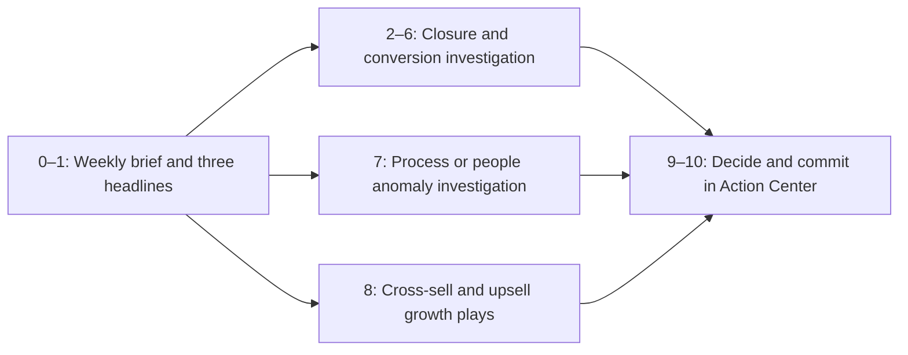

# Executive Journey and Use-Case Coverage

## Purpose

This document maps executive journey points **0–10** to the screens, evidence, and decisions implemented in NTT Command Centre. It also identifies where the three primary use cases appear:

1. Deal Closure Model
2. Cross-Sell / Upsell
3. Client Anomaly

The Executive experience uses five focused tabs instead of eleven separate pages. Several consecutive journey points are combined where they operate on the same ranked closure-exception list.

## Journey coverage: points 0–10

| Point | Journey question | Application coverage | Evidence or interaction | Status |
|---:|---|---|---|---|
| 0 | **The brief** | **The brief** (`tldr`) | Weekly scope, one primary banner, two supporting banners, and the five highest-priority insights | Covered |
| 1 | **Three headlines** | **The brief** (`tldr`) | The primary headline calls out low-probability Commit and Best Case deals; supporting headlines call out stuck pipeline and close-date slippage | Covered |
| 2 | **What closes it?** | **What closes it?** (`closure-risk`) | Up to ten curated commitments with low-probability Commit first, then Best Case, followed by distinct stalled and slipped exceptions | Covered |
| 3 | **Who is behind it?** | **What closes it?** (`closure-risk`) | Every exception names its owner; owner is also available as a local list filter and is carried into its action | Covered |
| 4 | **Trust the models?** | **What closes it?** (`closure-risk`) | Directional-model disclosure shows holdout AUC against chance. The UI tells the user to prioritize observable deal movement over the score | Covered |
| 5 | **Is it deteriorating?** | **What closes it?** (`closure-risk`) | Every exception now states its movement-based deterioration: close-date slips, stage regression, value decline, overdue age, or prolonged inactivity | Covered |
| 6 | **What fails with it?** | **What closes it?** (`closure-risk`) | The affected ACV Revenue is shown beside each commitment and carried into closure actions as optional Revenue impact | Covered |
| 7 | **Process or people?** | **Process or people?** (`anomalies`) | Findings show entity type, responsible owner, detector agreement, evidence, and an investigation question so the executive can separate operating-process issues from ownership issues | Covered |
| 8 | **What is the solution — grow out of it?** | **What's the solution?** (`opportunities`) | Up to five ranked cross-sell/up-sell plays show offering, customer reach, owner reach, confidence, strongest pilot account, evidence, and next step | Covered |
| 9 | **What to decide?** | **What to commit NOW?** (`action-center`) | Each action expands to concrete choices such as approve, investigate, request recovery, review, monitor, or dismiss. Reason is required where appropriate | Covered |
| 10 | **What to commit NOW?** | **What to commit NOW?** (`action-center`) | The chosen decision becomes a status with owner and due date. It persists in browser storage under the authenticated identity | Covered |

### Deliberate interpretation of the reference journey

- Point 2 uses **pipeline and conversion evidence**, rather than a bridge to a profit plan.
- Point 5 compares each commitment with its own movement history, rather than an against-plan chart.
- Point 6 exposes **ACV Revenue only** where it helps prioritize a closure decision.

These choices preserve the agreed Executive constraints: no profit, gross-profit, margin, budget, coverage, plan-gap, LOB, or industry views.

## Three use cases in the application

| Use case | Weekly Brief | Focused tab | Decision path |
|---|---|---|---|
| **Deal Closure Model** | Four decision headlines cover a stuck deal, close-date slippage, a low-probability Commit, and a low-probability Best Case | **What closes it?** (`closure-risk`) shows forecast category, risk, absolute probability, model limitations, owner, deterioration, close date, silence, and relevant ACV Revenue | Each Brief insight links directly to its expanded closure action with owner, due date, recovery/review choices, and optional Revenue impact |
| **Cross-Sell / Upsell** | The Brief journey link carries the user to the growth decision without crowding the five weekly pipeline headlines | **What's the solution?** (`opportunities`) ranks repeatable plays using customer count, owner count, confidence, pilot account, and recommendation evidence | Opportunity actions open in **Action Center** with approve-pilot, assign-owner, review, monitor, and dismiss choices |
| **Client Anomaly** | The second weekly insight surfaces the strongest demo-priority deal anomaly | **Process or people?** (`anomalies`) ranks findings by curated priority and severity, then shows entity, evidence, detector agreement, owner, and investigation question | The Brief insight links directly to its expanded anomaly action with investigation, assignment, monitoring, and dismissal choices |

The source examples and prioritization guidance are in [Top10_Strong_Examples_By_UseCase.xlsx](<deal pipeline context/Top10_Strong_Examples_By_UseCase.xlsx>).

## End-to-end Executive flow

## Implementation trace

| Concern | Implementation |
|---|---|
| Deterministic Executive messages, weekly ranking, closure exceptions, anomalies, opportunities, and actions | [`api/semantic/executive.py`](../ntt-command-centre/api/semantic/executive.py) |
| Executive page names and subheadings | [`api/semantic/views.py`](../ntt-command-centre/api/semantic/views.py) |
| Executive navigation order and access | [`api/semantic/personas.py`](../ntt-command-centre/api/semantic/personas.py) and [`SidebarNav.tsx`](../ntt-command-centre/web/src/components/SidebarNav.tsx) |
| Banner hierarchy, journey strip, focused lists, and Actions Center | [`ExecutivePage.tsx`](../ntt-command-centre/web/src/lenses/ExecutivePage.tsx) |
| Executive layout and responsive treatment | [`executive.css`](../ntt-command-centre/web/src/styles/executive.css) |
| Contract and identity-scoped behavior tests | [`test_auth.py`](../ntt-command-centre/api/scripts/test_auth.py) |

## Coverage rules

- Brief and focused tabs reuse the same deterministic domain messages.
- Executive scope is limited to Country and Quarter.
- Closure probability remains directional and is never presented as certainty.
- The Executive payload and UI exclude profit-related and plan-gap data.
- Every focused domain produces actions tagged as `closure`, `anomalies`, or `opportunities`.
- Action Center decisions are saved in the current browser and isolated by authenticated identity; they do not write back to CRM.
