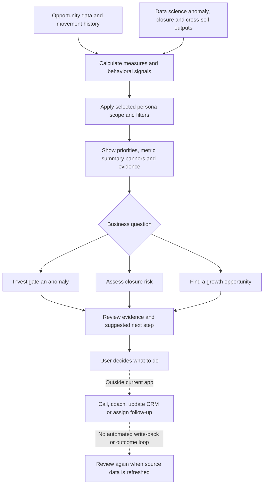
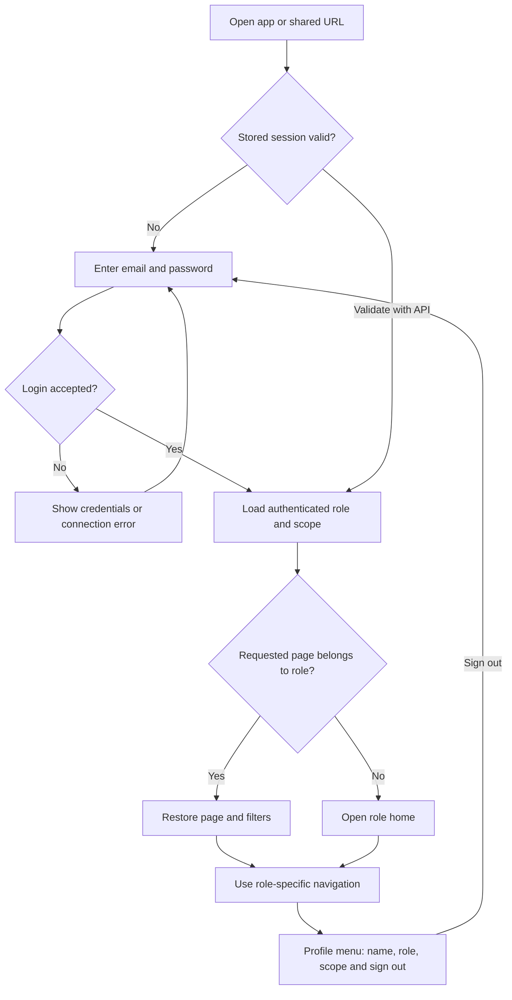
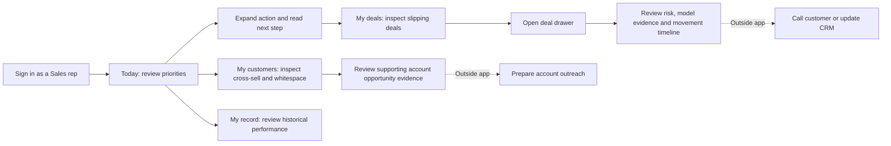
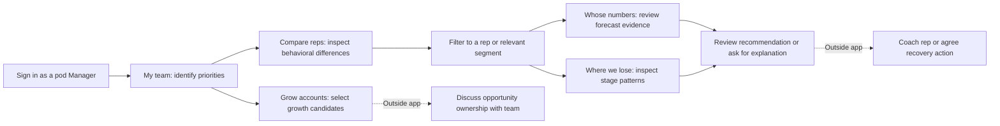
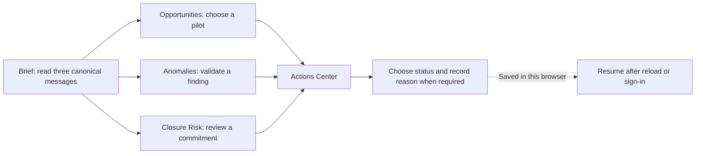
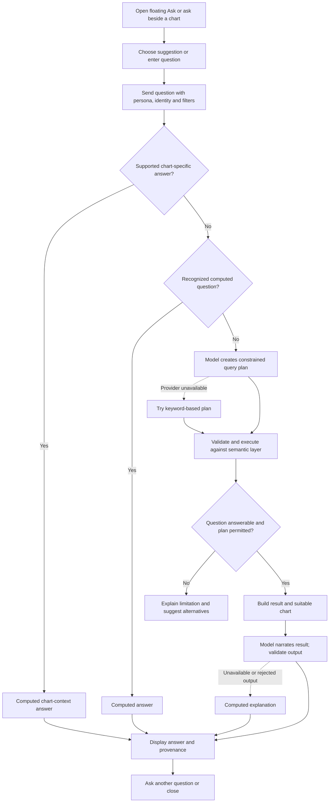

# NTT Deal Intelligence — Current Business and User Flow

Prepared: 23 September 2026  
Application: `ntt-command-centre/web/`, with its supporting `ntt-command-centre/api/`  
Basis: source-code inspection, updated after Phase 1 login implementation and browser verification on 23 September 2026. This document describes the implemented experience and identifies incomplete paths. It does not describe the separate root `web/` application.

## 1. Business purpose

Help North America sales teams turn pipeline data into a decision: which deal needs attention, what explains its risk, where an existing account could buy more, and where leadership should direct attention and resources.

The experience supports three business capabilities:

| Capability | Business question | Evidence shown | Decision supported |
|---|---|---|---|
| Anomaly detection | What looks unusual and needs review? | Findings, severity, value at stake, source evidence and movement history | Investigate a deal, coach a rep or review a business segment |
| Deal closure and risk | Which deals may slip, and why? | Risk factors, model probability, driver explanation, feature benchmarks and timeline | Prioritize follow-up and challenge a forecast |
| Cross-sell / upsell | Where can we sell more to existing accounts? | Peer buying patterns, account whitespace and DS recommendations | Select an account opportunity or a repeatable growth play |

The current product supports observation, investigation and recommendations. Calls, coaching, CRM updates, assignments and outcome tracking take place outside this web application; no completed action-management workflow is implemented here.

### Business flow

Data engineering may compute reusable signals across the book; persona predicates and selected filters are applied before scoped page aggregations. A user decision does not update the source files.

## 2. Personas and decision boundaries

| UI persona | Scope | Main decision | Home page | Pages |
|---|---|---|---|---|
| Sales (`ae`) | Selected account executive's owned opportunities | Which deals should I call today, and what should I say? | Today | 4 |
| Manager (`manager`) | Selected pod's reps | Which patterns need coaching or intervention? | My team | 5 |
| Executive (`executive`) | North America book | Which opportunity, anomaly or closure signal needs attention? | Brief | 5 |

There are **14 current pages**: four Sales, five Manager and five Executive pages.

Eleven demo accounts now provide individual email/password login: four Sales reps, six existing managers, and one North America Executive. The server resolves a signed session to the account's assigned role and identity. Users cannot select another persona after login; they sign out and use another account. Manager pods remain derived from the sales roster, rather than sourced from a Salesforce manager hierarchy.

See [the implemented login plan](Plans/PLAN.md) for the account roster. Passwords are generated locally and recorded in the gitignored `Plans/DEMO_CREDENTIALS.local.md`; they are not part of this document.

Sales users do not receive entity budget, gap, coverage or entity-concentration measures. Managers do not receive entity budget or gap measures. The Executive experience is fixed to Revenue and excludes profit, margin, budget, coverage and plan-gap data from its views, detail payloads and Ask answers. These scope rules are enforced behind authenticated demo accounts. Enterprise SSO and user administration remain future work.

## 3. Entry and navigation flow

- The login uses a light NTT design with email, password, reveal control and Sign in. No role selector, signup or password reset is included.
- Sales starts on Today, Manager on My team, and Executive on Brief. Profit remains the default for Sales and Manager; Executive is fixed to Revenue and has no measure switch.
- The API validates the session before the application mounts. Sessions expire after eight hours and use per-tab session storage, with an in-memory fallback when storage is unavailable.
- The sidebar includes only the authenticated user's pages. The profile menu displays that user's name, role and scope instead of a persona picker.
- Page navigation remains query-string based. `as` and `id` no longer select a user; permitted page/filter links can be restored after login.
- A page change closes the deal drawer while retaining filters. Sign-out clears the session, URL selections, mounted app state and outstanding requests.
- Browser history tracks views. Ask transcripts and expanded cards remain temporary UI state.
- A 401 or session expiry returns to the gate. Sign-out removes the browser token; it does not revoke copied bearer tokens before expiry. Disabling the account server-side blocks subsequent requests.

## 4. Page map

Page labels and questions below are taken from the current backend navigation registry.

### Sales

| Sidebar group | Page / key | User question | Main evidence and interaction |
|---|---|---|---|
| Today | Today / `my-day` | What should I do first? | Prioritized action cards, deal triage and risk bands; inspect a recommendation or open a deal |
| My book | My deals / `my-deals` | Which deals are slipping? | Timeline, ageing, pipeline by stage and deal list; open deal details |
| My book | My customers / `my-accounts` | Where can I sell more? | Cross-sell list, whitespace, account composition and opportunity evidence; account detail links are incomplete |
| Me | My record / `my-record` | How am I doing? | Wins over time, funnel and portfolio pipeline; narrow evidence and ask a question |

### Manager

| Sidebar group | Page / key | User question | Main evidence and interaction |
|---|---|---|---|
| This week | My team / `pod-pulse` | Who needs me this week? | Risk bands, stalled deals by rep and rep summaries |
| The people | Compare reps / `rep-benchmark` | Who is off the pattern? | Behavior benchmark heatmap, rep pipeline and comparisons |
| The people | Whose numbers / `calibration` | Whose forecast can I trust? | Deal triage, ageing and rep evidence |
| The process | Where we lose / `process` | Where do deals fall out? | Stage funnel and stage-path flow |
| The process | Grow accounts / `pod-whitespace` | What should the team sell next? | Cross-sell candidates, account whitespace and margin mix |

### Executive

| Sidebar group | Page / key | User question | Main evidence and interaction |
|---|---|---|---|
| Attention | Brief / `tldr` | What needs attention? | Restored weekly pipeline banner and five evidence-rich decisions: three on conversion/closure, one expansion signal and one client anomaly |
| Attention | Opportunities / `opportunities` | Which plays are ready to run? | Up to five ranked plays with customer reach, owners, confidence, pilot account and next step |
| Attention | Anomalies / `anomalies` | What looks unusual enough to investigate? | Prioritized operational findings with detector agreement, evidence, owner and investigation question |
| Attention | Closure Risk / `closure-risk` | Which commitments are least likely to close? | Up to ten exceptions with directional probability, observable driver, silence, date and relevant ACV Revenue |
| Decide | Actions Center / `action-center` | What is owned, due, or waiting? | Domain-tagged actions, local filters and browser-persistent decisions isolated by account |

## 5. Shared page experience

The page presents information in this order:

1. **Decision question and page controls** — page heading, scope, quarter, business as-of date, Profit/Revenue switch and compact More filters control.
2. **Active filter chips** — show the server-applied scope immediately; remove an individual selection or clear the view.
3. **Metric summary banners** — one primary conclusion and two supporting summaries that retain every page-relevant metric as an individually referenceable figure.
4. **Narrative** — a computed explanation initially, with an AI brief requested separately.
5. **Action items** — priority, business impact, explanation and suggested next step.
6. **Evidence charts** — inspect the distribution, use its contextual selectors, click supported marks to filter, or ask about the chart.
7. **Page-specific detail** — deal list, rep evidence, whitespace, performance detail, findings or executive context where implemented.

This shared sequence applies to Sales and Manager. Executive pages use the lighter pattern: page heading, active Country/Quarter filters, the canonical domain message, one focused worklist, and relevant action links. Brief restores a single weekly summary banner and ranks five evidence-rich insights, led by pipeline analysis and conversion quality. Actions Center shows the decision list. Executive pages do not render the generic metric-banner group, AI narrative panels, generic charts or the shared action rail. The floating Ask entry remains available.

The surrounding shell contains the logo, menu toggle, light/dark theme control, signed-in profile menu, grouped sidebar, floating **Ask AI Expert** button and source-count footer. Filter options belong to the page sections they affect rather than a shell-level deck. The current Header does not render the findings bell or header Ask button mentioned in older documentation.

### Filtering and state

| Persona | Visible filter controls |
|---|---|
| Sales | Stage, forecast, LOB, portfolio, account, order type |
| Manager | Rep, stage, LOB, portfolio, order type, quarter |
| Executive | Country and quarter |

Filters are single-value per dimension. Dimensions represented by a chart appear in that chart's header; dimensions with no natural chart location appear in **More filters** beside the page question. Active selections appear below the heading. Selecting a control sets its value, while clicking a supported chart mark toggles that value. Both trigger server requests so banners, actions, charts and business aggregates are recomputed for one consistent scope. Local sorting and filtering of already-returned action items or findings do not recompute the page's business totals.

Profit is the default measure for Sales and Manager; their Profit/Revenue switch sits beside the page question. Executive is fixed to Revenue and displays it only where it helps prioritize a closure decision. URL state includes page, measure, filters, Ask-open state, drawer identifier and an optional expanded Actions Center key. Persona and identity come from the authenticated session. Theme uses its own local storage preference.

Example Executive view: `?page=closure-risk&country=Canada&quarter=FY26-Q2`. Legacy Executive links redirect to the matching focused page.

## 6. Persona journeys

These are suggested sequences through existing screens, not mandatory wizards. Users can move directly between their persona's pages.

### Sales: prioritize a deal, then identify growth

The deal drawer contains deal facts, observable risk factors, closure model output, benchmarks and movement timeline. Its displayed evidence is computed, not generated prose. Closing it returns to the underlying page. The account name links on the whitespace block currently do not open a rendered account drawer; use the visible page evidence when describing this journey.

### Manager: identify a pattern and prepare coaching

Success means the manager can identify the behavior, affected book and evidence behind a coaching discussion. The app does not record coaching completion or assign the opportunity.

### Executive: carry one signal into a decision

Success means the message seen on Brief remains unchanged on its detail page and leads to an owned action. Actions Center decisions persist in the browser under the authenticated identity; they do not imply CRM write-back and never appear for another account.

## 7. Investigation and AI interactions

### Action items and findings

| User action | Implemented response |
|---|---|
| Select an action card / Details | Expand evidence, rule, business impact and next step |
| Filter or sort action cards | Rearrange the returned recommendation list |
| Select a scope control on a card | Toggle the relevant page filter |
| Open a deal link | Open the deal drawer with scoped API data |
| Select Explain | Request a narrative explanation for the card |
| Expand a finding on What is wrong | Show its evidence, source and suggested review step |
| Select finding entity or scope | Open a supported deal or narrow the page |
| Ask from a finding | Open the main Ask panel with a question |

An anomaly is a review signal. A probability is a model estimate. A cross-sell recommendation is a candidate opportunity. The user reviews the evidence before choosing a next step.

### Ask AI Expert

The backend contains real Anthropic, Gemini and OpenRouter integrations, attempted in that order when configured. This diagram represents the coded decision path, not a verified live-provider test.

The main Ask panel displays questions and answers as temporary turns. It supports retry and alternative questions. Each request sends the current question and scope; it does not send the full visible transcript as model conversation history. A user should therefore phrase follow-up questions explicitly rather than assume persistent conversational memory.

Chart Ask begins beside the relevant evidence and can expand into the main panel, carrying its displayed turns. Closing the main panel unmounts its transcript. Reopening from a shared URL restores the panel's open state, not its prior conversation.

The AI layer checks numeric tokens against supplied facts and filters redundant chart claims. These checks reduce unsupported output but should not be described as proof that every generated interpretation is correct. Page metrics and charts do not wait for a model response.

## 8. Empty, error and recovery flows

| Condition | Current experience / recovery |
|---|---|
| Wrong email or password | Gate shows a credentials error; user can retry |
| Login server unavailable | Gate shows a connection error |
| Token expired or API returns 401 | App returns to gate; URL view state remains |
| Metadata request fails | Shell shows that the semantic layer did not answer and asks for reload |
| Page request loading | Page skeleton; previous page payload is not used as the new result |
| Page request fails | Page error with Try again |
| Chart rendering fails | Chart-level error boundary limits the failure to that card |
| Chart has a defined empty result | Display its supplied empty-state message |
| Deal detail fails | Drawer error with retry |
| Ask request fails | Failed question remains visible with retry |
| Model unavailable | Computed answer or an explanation of what cannot be answered |
| Narrow screen | Sidebar becomes a drawer; page controls wrap and More filters becomes a single-column popover |

Ask and deal dialogs include Escape handling, focus containment and focus restoration. These behaviors were inspected in source, not validated with assistive technology in this review.

## 9. Current boundaries and incomplete paths

| Observation | Effect on the business/user flow | Source evidence |
|---|---|---|
| Account drawer is not mounted | Account links can change URL state without displaying account detail | `WhitespaceBlock` emits `account:<code>`; `App.tsx` only mounts the drawer for `deal:` |
| Sales and Manager recommendations have no task lifecycle | Their follow-up remains outside the app; Executive Actions Center decisions persist only in the current browser | `ActionRail` and `ExecutivePage` |
| Fixed demo accounts | Authenticated demo roles and scopes; organizational SSO and user administration are not implemented | Gate, API client, auth module and server account registry |
| Executive decisions are browser-local | Status and reason survive reload and logout on this browser, but are not CRM records | `ExecutivePage` local storage namespace |
| Local Ask transcript is not persistent conversation memory | Reopened sessions lose the visible turns; follow-ups are separate scoped questions | AskPanel state and `api.ask` request arguments |
| Source data is file-backed | Business actions do not immediately change the dashboards through CRM synchronization | API configuration and semantic loader |

Remaining gaps above are outside the Phase 1 login implementation.

## 10. Source map

Paths are relative to this document so the evidence can be opened from the repository.

| Topic | Source |
|---|---|
| Business requirements | [Functional requirements](../ntt-command-centre/docs/SOW-functional-requirements.txt) |
| Current page labels and questions | [views.py](../ntt-command-centre/api/semantic/views.py) |
| Persona scopes and restrictions | [personas.py](../ntt-command-centre/api/semantic/personas.py) |
| Mounted shell and drawers | [App.tsx](../ntt-command-centre/web/src/App.tsx) |
| Authentication gate | [Gate.tsx](../ntt-command-centre/web/src/components/Gate.tsx) |
| Navigation grouping | [SidebarNav.tsx](../ntt-command-centre/web/src/components/SidebarNav.tsx) |
| Persona and theme controls | [Header.tsx](../ntt-command-centre/web/src/components/Header.tsx) |
| Shared page composition and detail blocks | [PageView.tsx](../ntt-command-centre/web/src/lenses/PageView.tsx) |
| Focused Executive experience and Actions Center | [ExecutivePage.tsx](../ntt-command-centre/web/src/lenses/ExecutivePage.tsx) |
| Filter controls | [FilterBar.tsx](../ntt-command-centre/web/src/components/FilterBar.tsx) |
| URL state and transitions | [filters.ts](../ntt-command-centre/web/src/state/filters.ts), [AppStateProvider.tsx](../ntt-command-centre/web/src/state/AppStateProvider.tsx) |
| Action interactions | [ActionRail.tsx](../ntt-command-centre/web/src/components/ActionRail.tsx) |
| Finding investigation | [Findings.tsx](../ntt-command-centre/web/src/components/Findings.tsx) |
| Deal evidence | [DealDrawer.tsx](../ntt-command-centre/web/src/components/DealDrawer.tsx) |
| Ask and chart handoff | [AskPanel.tsx](../ntt-command-centre/web/src/components/AskPanel.tsx), [ChartCard.tsx](../ntt-command-centre/web/src/components/ChartCard.tsx) |
| API requests and access state | [client.ts](../ntt-command-centre/web/src/api/client.ts) |
| Question planning and fallbacks | [service.py](../ntt-command-centre/api/llm/service.py), [providers.py](../ntt-command-centre/api/llm/providers.py) |

### Review checklist

- All 14 current page keys and labels included.
- Three persona journeys mapped to actual navigation and evidence surfaces.
- Business follow-up distinguished from implemented on-screen interactions.
- Incomplete account navigation and browser-local Executive action tracking explicitly marked.
- Login, fixed role scope, logout, filtering, Ask, detail inspection and recovery represented.
- Source links included for maintaining this document as the application changes.
