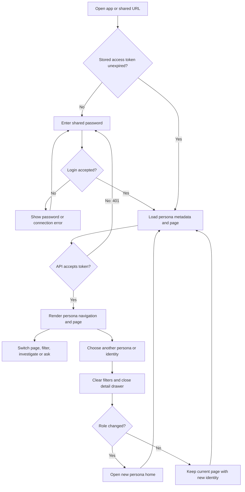
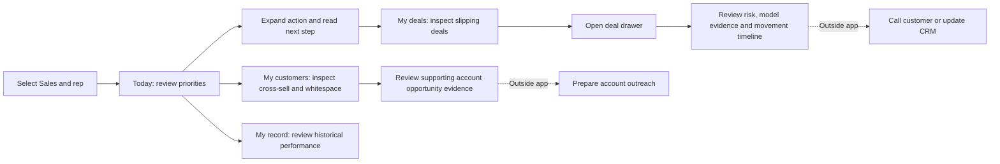
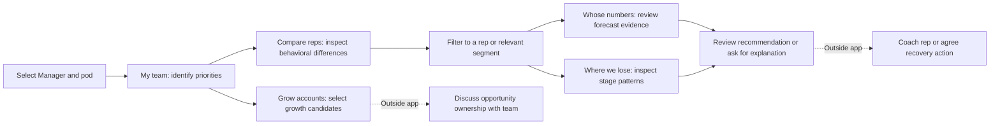
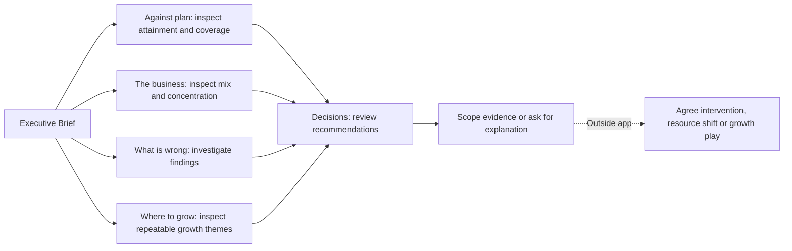
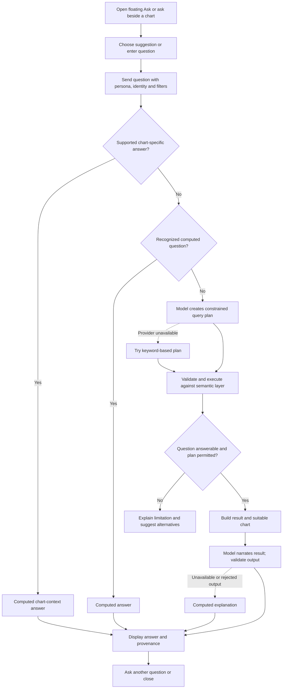

# NTT Deal Intelligence — Current Business and User Flow

Prepared: 23 September 2026  
Application: `ntt-command-centre/web/`, with its supporting `ntt-command-centre/api/`  
Basis: current source-code inspection, not a browser walkthrough. This document describes the implemented experience and identifies incomplete paths. It does not describe the separate root `web/` application.

## 1. Business purpose

Help North America sales teams turn pipeline data into a decision: which deal needs attention, what explains its risk, where an existing account could buy more, and where leadership should direct attention and resources.

The experience supports three business capabilities:

| Capability | Business question | Evidence shown | Decision supported |
|---|---|---|---|
| Anomaly detection | What looks unusual and needs review? | Findings, severity, value at stake, source evidence and movement history | Investigate a deal, coach a rep or review a business segment |
| Deal closure and risk | Which deals may slip, and why? | Risk factors, model probability, driver explanation, feature benchmarks and timeline | Prioritize follow-up and challenge a forecast |
| Cross-sell / upsell | Where can we sell more to existing accounts? | Peer buying patterns, account whitespace and DS recommendations | Select an account opportunity or a repeatable growth play |

The current product supports observation, investigation and recommendations. Calls, coaching, CRM updates, assignments and outcome tracking take place outside this web application; no completed action-management workflow is implemented here.

### Business flow

Data engineering may compute reusable signals across the book; persona predicates and selected filters are applied before scoped page aggregations. A user decision does not update the source files.

## 2. Personas and decision boundaries

| UI persona | Scope | Main decision | Home page | Pages |
|---|---|---|---|---|
| Sales (`ae`) | Selected account executive's owned opportunities | Which deals should I call today, and what should I say? | Today | 4 |
| Manager (`manager`) | Selected pod's reps | Which patterns need coaching or intervention? | My team | 5 |
| Executive (`executive`) | North America book | Where should money and attention move this quarter? | Brief | 6 |

There are **15 current pages**. Older README text and component comments refer to 14; the current registry includes the executive `growth` page.

The shared password grants entry to the demo. The persona picker selects a role and an identity; it is not a verified employee login. The backend narrows data using that selection. Manager pods are derived from the rep book, not sourced from a manager hierarchy in Salesforce.

Sales users do not receive entity budget, gap, coverage or entity-concentration measures. Managers do not receive entity budget or gap measures. Executive measure restrictions exclude certain deal-level next-step and silence measures. These are scope rules in the current semantic layer, not proof of production identity authorization.

## 3. Entry and navigation flow

- Without URL selections, the app starts as Executive on Brief, with Profit as the measure.
- Login preserves the current URL-based view. A 401 clears stored access and returns to the gate.
- The sidebar contains only pages belonging to the selected persona. The server resolves an invalid or other-persona page request to the selected persona's home payload.
- Navigation is query-string based rather than a separate pathname for each page.
- A page change closes the deal drawer and retains the current filters. A persona or identity change clears filters and closes the drawer.
- Browser history records view changes. Ask transcripts and expanded cards are temporary UI state.

## 4. Page map

Page labels and questions below are taken from the current backend navigation registry.

### Sales

| Sidebar group | Page / key | User question | Main evidence and interaction |
|---|---|---|---|
| Today | Today / `my-day` | What should I do first? | Prioritized action cards, deal triage and risk bands; inspect a recommendation or open a deal |
| My book | My deals / `my-deals` | Which deals are slipping? | Timeline, ageing, pipeline by stage and deal list; open deal details |
| My book | My customers / `my-accounts` | Where can I sell more? | Cross-sell list, whitespace, account composition and opportunity evidence; account detail links are incomplete |
| Me | My record / `my-record` | How am I doing? | Wins over time, funnel and portfolio pipeline; narrow evidence and ask a question |

### Manager

| Sidebar group | Page / key | User question | Main evidence and interaction |
|---|---|---|---|
| This week | My team / `pod-pulse` | Who needs me this week? | Risk bands, stalled deals by rep and rep summaries |
| The people | Compare reps / `rep-benchmark` | Who is off the pattern? | Behavior benchmark heatmap, rep pipeline and comparisons |
| The people | Whose numbers / `calibration` | Whose forecast can I trust? | Deal triage, ageing and rep evidence |
| The process | Where we lose / `process` | Where do deals fall out? | Stage funnel and stage-path flow |
| The process | Grow accounts / `pod-whitespace` | What should the team sell next? | Cross-sell candidates, account whitespace and margin mix |

### Executive

| Sidebar group | Page / key | User question | Main evidence and interaction |
|---|---|---|---|
| The read | Brief / `tldr` | What do I need to know? | Profit bridge, risk bands, model context and links into the three use cases |
| The numbers | Against plan / `performance` | Are we on track? | Monthly plan comparison, coverage, wins and quarter detail |
| The numbers | The business / `structure` | Where does the money sit? | Margin mix, account concentration and industry flow |
| The decisions | What is wrong / `risks` | What needs fixing, and what is it worth? | Anomaly categories, ageing, stage behavior and expandable findings |
| The decisions | Where to grow / `growth` | Which growth ideas repeat often enough to run as a play? | Cross-sell themes and growth matrix, plus common page cards and narrative |
| The decisions | Decisions / `actions` | What needs deciding now? | Ranked recommendations and coverage by LOB and portfolio |

## 5. Shared page experience

The page presents information in this order:

1. **Decision question** — page heading, scope, quarter and business as-of date.
2. **KPIs** — measures relevant to that page's question.
3. **Narrative** — a computed explanation initially, with an AI brief requested separately.
4. **Action cards** — priority, business impact, explanation and suggested next step.
5. **Active filter chips** — remove an individual selection or clear the view.
6. **Evidence charts** — inspect the distribution, click supported marks to filter, or ask about the chart.
7. **Page-specific detail** — deal list, rep evidence, whitespace, performance detail, findings or executive context where implemented.

The surrounding shell contains the logo, menu toggle, light/dark theme control, persona picker, grouped sidebar, filter deck, floating **Ask AI Expert** button and source-count footer. The current Header does not render the findings bell or header Ask button mentioned in older documentation.

### Filtering and state

| Persona | Visible filter controls |
|---|---|
| Sales | Stage, forecast, LOB, portfolio, account, order type |
| Manager | Rep, stage, LOB, portfolio, order type, quarter |
| Executive | LOB, portfolio, industry, country, quarter, order type, stage |

Filters are single-value per dimension. Selecting a control sets its value; clicking a supported chart mark toggles that value. Selections trigger server requests so business aggregates are recomputed for the selected scope. Local sorting and filtering of already-returned action cards or findings do not recompute the page's business totals.

Profit is the default measure; Revenue switches the measure for the current slice. URL state includes persona (`as`), identity (`id`), page, measure, filters, Ask-open state and drawer identifier. It does not contain the Ask transcript or question text. Theme uses its own local storage preference and can be initialized from a `theme` URL parameter.

Example view: `?as=executive&page=growth&lob=Security&measure=revenue`.

## 6. Persona journeys

These are suggested sequences through existing screens, not mandatory wizards. Users can move directly between their persona's pages.

### Sales: prioritize a deal, then identify growth

The deal drawer contains deal facts, observable risk factors, closure model output, benchmarks and movement timeline. Its displayed evidence is computed, not generated prose. Closing it returns to the underlying page. The account name links on the whitespace block currently do not open a rendered account drawer; use the visible page evidence when describing this journey.

### Manager: identify a pattern and prepare coaching

Success means the manager can identify the behavior, affected book and evidence behind a coaching discussion. The app does not record coaching completion or assign the opportunity.

### Executive: investigate exposure and select a decision

Success means a decision supported by scope, value, evidence and caveats. Clicking a decision card does not execute a resource reallocation or create an approval record.

## 7. Investigation and AI interactions

### Action cards and findings

| User action | Implemented response |
|---|---|
| Select an action card / Details | Expand evidence, rule, business impact and next step |
| Filter or sort action cards | Rearrange the returned recommendation list |
| Select a scope control on a card | Toggle the relevant page filter |
| Open a deal link | Open the deal drawer with scoped API data |
| Select Explain | Request a narrative explanation for the card |
| Expand a finding on What is wrong | Show its evidence, source and suggested review step |
| Select finding entity or scope | Open a supported deal or narrow the page |
| Ask from a finding | Open the main Ask panel with a question |

An anomaly is a review signal. A probability is a model estimate. A cross-sell recommendation is a candidate opportunity. The user reviews the evidence before choosing a next step.

### Ask AI Expert

The backend contains real Anthropic, Gemini and OpenRouter integrations, attempted in that order when configured. This diagram represents the coded decision path, not a verified live-provider test.

The main Ask panel displays questions and answers as temporary turns. It supports retry and alternative questions. Each request sends the current question and scope; it does not send the full visible transcript as model conversation history. A user should therefore phrase follow-up questions explicitly rather than assume persistent conversational memory.

Chart Ask begins beside the relevant evidence and can expand into the main panel, carrying its displayed turns. Closing the main panel unmounts its transcript. Reopening from a shared URL restores the panel's open state, not its prior conversation.

The AI layer checks numeric tokens against supplied facts and filters redundant chart claims. These checks reduce unsupported output but should not be described as proof that every generated interpretation is correct. Page metrics and charts do not wait for a model response.

## 8. Empty, error and recovery flows

| Condition | Current experience / recovery |
|---|---|
| Wrong password | Gate shows a password error; user can retry |
| Login server unavailable | Gate shows a connection error |
| Token expired or API returns 401 | App returns to gate; URL view state remains |
| Metadata request fails | Shell shows that the semantic layer did not answer and asks for reload |
| Page request loading | Page skeleton; previous page payload is not used as the new result |
| Page request fails | Page error with Try again |
| Chart rendering fails | Chart-level error boundary limits the failure to that card |
| Chart has a defined empty result | Display its supplied empty-state message |
| Deal detail fails | Drawer error with retry |
| Ask request fails | Failed question remains visible with retry |
| Model unavailable | Computed answer or an explanation of what cannot be answered |
| Narrow screen | Sidebar becomes a drawer; small-screen filter deck scrolls horizontally |

Ask and deal dialogs include Escape handling, focus containment and focus restoration. These behaviors were inspected in source, not validated with assistive technology in this review.

## 9. Current boundaries and incomplete paths

| Observation | Effect on the business/user flow | Source evidence |
|---|---|---|
| Account drawer is not mounted | Account links can change URL state without displaying account detail | `WhitespaceBlock` emits `account:<code>`; `App.tsx` only mounts the drawer for `deal:` |
| Recommendations have no task lifecycle | User must perform and track follow-up elsewhere; no owner/due-date/status completion loop is shown | ActionRail handlers are scope, drill and explanation; no action-write workflow in the current API |
| Shared access plus selectable personas | Persona journeys are demo views, not authenticated employee role assignments | Gate, API client and persona resolver |
| Growth extras have no dedicated page block | Growth uses shared cards/charts/narrative; extra backend growth fields do not all become a dedicated details section | `views.extras` supplies growth data; `PageExtras` has no `growth` case |
| Documentation names obsolete controls/page count | Design discussions should use this current 15-page map and mounted components | Current `PAGES`, `Header` and `App` |
| Local Ask transcript is not persistent conversation memory | Reopened sessions lose the visible turns; follow-ups are separate scoped questions | AskPanel state and `api.ask` request arguments |
| Source data is file-backed | Business actions do not immediately change the dashboards through CRM synchronization | API configuration and semantic loader |

These observations are documentation findings; this task does not change their implementation.

## 10. Source map

Paths are relative to this document so the evidence can be opened from the repository.

| Topic | Source |
|---|---|
| Business requirements | [Functional requirements](../ntt-command-centre/docs/SOW-functional-requirements.txt) |
| Current page labels and questions | [views.py](../ntt-command-centre/api/semantic/views.py) |
| Persona scopes and restrictions | [personas.py](../ntt-command-centre/api/semantic/personas.py) |
| Mounted shell and drawers | [App.tsx](../ntt-command-centre/web/src/App.tsx) |
| Authentication gate | [Gate.tsx](../ntt-command-centre/web/src/components/Gate.tsx) |
| Navigation grouping | [SidebarNav.tsx](../ntt-command-centre/web/src/components/SidebarNav.tsx) |
| Persona and theme controls | [Header.tsx](../ntt-command-centre/web/src/components/Header.tsx) |
| Shared page composition and detail blocks | [PageView.tsx](../ntt-command-centre/web/src/lenses/PageView.tsx) |
| Filter controls | [FilterBar.tsx](../ntt-command-centre/web/src/components/FilterBar.tsx) |
| URL state and transitions | [filters.ts](../ntt-command-centre/web/src/state/filters.ts), [AppStateProvider.tsx](../ntt-command-centre/web/src/state/AppStateProvider.tsx) |
| Action interactions | [ActionRail.tsx](../ntt-command-centre/web/src/components/ActionRail.tsx) |
| Finding investigation | [Findings.tsx](../ntt-command-centre/web/src/components/Findings.tsx) |
| Deal evidence | [DealDrawer.tsx](../ntt-command-centre/web/src/components/DealDrawer.tsx) |
| Ask and chart handoff | [AskPanel.tsx](../ntt-command-centre/web/src/components/AskPanel.tsx), [ChartCard.tsx](../ntt-command-centre/web/src/components/ChartCard.tsx) |
| API requests and access state | [client.ts](../ntt-command-centre/web/src/api/client.ts) |
| Question planning and fallbacks | [service.py](../ntt-command-centre/api/llm/service.py), [providers.py](../ntt-command-centre/api/llm/providers.py) |

### Review checklist

- All 15 current page keys and labels included.
- Three persona journeys mapped to actual navigation and evidence surfaces.
- Business follow-up distinguished from implemented on-screen interactions.
- Incomplete account navigation and action tracking explicitly marked.
- Login, scope changes, filtering, Ask, detail inspection and recovery represented.
- Source links included for maintaining this document as the application changes.
