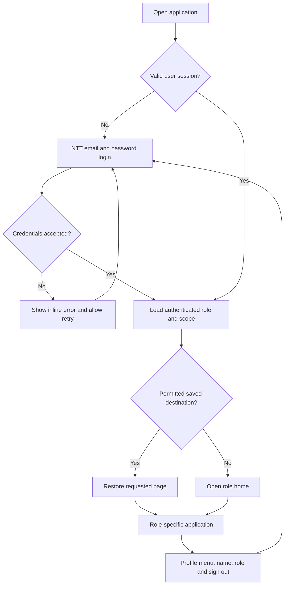

# Phase 1 — Demo Login and Role-Based Entry

## Summary

Replace the shared-password gate with email/password login for **11 walkthrough accounts: four Sales reps, six Managers and one Executive**, using the identities already represented in the application.

Use a clean, light NTT login design. After login, automatically open the user’s role-specific home and navigation. Keep existing dashboards and sidebar groups.

**Plan document:** `Context/Plans/PLAN.md`  
**Status:** Implemented locally on 23 September 2026. All 11 accounts generated; API and browser verification completed. Deployment remains separate.  
**Reference:** [Current business and user flow](../NTT_Command_Centre_Business_and_User_Flow.md).

## 1. Demo accounts

| User | Demo login email | Role / scope | Landing page |
|---|---|---|---|
| Brian Thompson | `brian.thompson@global.ntt` | Sales — Brian’s opportunities | Today |
| Karen Phillips | `karen.phillips@global.ntt` | Sales — Karen’s opportunities | Today |
| Melissa Adams | `melissa.adams@global.ntt` | Sales — Melissa’s opportunities | Today |
| Scott Carter | `scott.carter@global.ntt` | Sales — Scott’s opportunities | Today |
| Dana Whitfield | `dana.whitfield@demo.ntt.example` | Manager — Pod A | My team |
| Marcus Lindqvist | `marcus.lindqvist@demo.ntt.example` | Manager — Pod B | My team |
| Priya Raghavan | `priya.raghavan@demo.ntt.example` | Manager — Pod C | My team |
| Tomás Oliveira | `tomas.oliveira@demo.ntt.example` | Manager — Pod D | My team |
| Hannah Brecht | `hannah.brecht@demo.ntt.example` | Manager — Pod E | My team |
| Kenji Nakamura | `kenji.nakamura@demo.ntt.example` | Manager — Pod F | My team |
| Vikesh | `executive.na@demo.ntt.example` | Executive — North America | Brief |

- Brian is the current default Sales identity, with 37 open opportunities.
- Karen, Melissa and Scott are the next three reps ranked by open-opportunity count (14, 11 and 9 respectively in the current source dataset), providing active books for the walkthrough. Their names and emails come from the existing opportunity roster.
- Preserve the existing six pod assignments and all 70 reps in the dataset. Brian, Karen, Melissa and Scott receive Sales logins in this phase; each is scoped to their own opportunities.
- Normalize emails for case and whitespace; accept each selected Sales rep’s existing underscore email as an alias for the same account. Aliases share one password and scope, rather than creating extra accounts.
- Manager and Executive emails are invented demo identifiers, not mailboxes.
- Generate a distinct random password for each account during setup. Store password hashes in a server-only account file.
- Produce a gitignored local credentials sheet in `Context/Plans/` for walkthrough use. Do not display credentials on the login page or bundle them into frontend code.

## 2. Login and navigation experience

**Login screen**

- White background, existing NTT logo, blue primary button and compact centered form.
- Heading: “Sign in to Deal Intelligence.”
- Email, password, show/hide password, and “Sign in” button.
- Required-field validation, signing-in state, generic invalid-credentials message and separate connection-error message.
- Accessible labels, keyboard submission, visible focus and mobile layout.
- No role selector, signup, password reset or “remember me” in this phase.

**After login**

- Replace the persona picker with the authenticated user’s name, role, scope and Sign out.
- Keep the current Sales, Manager and Executive sidebar groups and pages.
- Derive identity from the session; remove `as` and `id` as user-controlled navigation state.
- Preserve permitted page/filter deep links; replace an inaccessible destination with the role’s home.
- Sign out clears session, filters, drawers, Ask transcript and pending requests. Switching accounts requires another login.
- Retain the existing dashboard theme controls; the new login screen always uses the selected light design.

## 3. Authentication and API changes

- Extend `POST /api/auth/login` to accept `{email, password}` and return an expiring bearer token plus the authenticated user profile.
- Add `GET /api/auth/me` to validate the session and return name, role, scope identity and home page.
- Use signed tokens containing a stable account identifier and expiry. Resolve role and scope from the server’s account registry on every request.
- Use an eight-hour session stored in browser session storage. Refresh restores it; closing the tab ends local persistence.
- Sign out removes the browser token. Immediate server-side token revocation is outside this demo phase.
- Reject old shared-password tokens and remove the existing access-bypass behavior from the interactive app’s authentication path.
- Replace caller-selected principals with authenticated principals across data and AI endpoints. Query parameters and `X-User-UPN` must not override the logged-in identity.
- Check account detail, anomaly and aggregate endpoints for scope enforcement, including routes currently lacking a principal.
- Return only the current user’s navigation metadata; stop returning the complete identity picker roster.
- Keep an unauthenticated liveness response minimal; protect detailed business-data health information.

Existing business calculations, model integrations and chart contracts remain the basis of the role-specific pages.

## 4. Verification and delivery

**Acceptance checks**

- All 11 accounts authenticate and land on the correct page.
- Brian, Karen, Melissa and Scott each see only their own scoped book; each manager sees the existing pod; Executive sees North America.
- Each Sales account accepts its canonical dotted email and existing underscore alias, including case variations, while retaining the same identity and scope.
- Switching between the four Sales accounts clears prior-user data; direct requests for another rep’s opportunities are denied.
- Editing URLs, request headers or persona parameters cannot impersonate another account.
- Out-of-scope deal/account access fails without exposing record details.
- Wrong credentials, expired tokens, old tokens and unavailable API produce the intended recovery states.
- Refresh restores a valid session; unauthorized deep links return to the role home.
- Logout followed by another user’s login shows no previous-user data or transcript.
- Login works with keyboard navigation and at mobile and desktop widths.
- Frontend production build and relevant backend regression checks pass.

**Delivery**

- Keep this saved plan current and update the business/user-flow document during implementation.
- Include an idempotent setup command that creates the 11 accounts and credentials sheet without resetting passwords on rerun.
- Configure account hashes and the signing secret only on the backend.
- Release frontend and backend together; existing users must sign in again.

**Scope boundary:** this phase implements demo account login and role-based entry. SSO, user administration, dashboard redesign, account-drawer completion and action tracking remain later work.

## Implementation notes

- Account setup: run `python -m api.scripts.setup_demo_accounts` from `ntt-command-centre/` using its existing `api/myenv` interpreter.
- Local passwords: [Demo credentials](DEMO_CREDENTIALS.local.md), excluded from Git and frontend bundles.
- Authentication is always required for business endpoints. The previous shared-password token and access-disable switches no longer grant access.
- Sessions use a server-signed account identifier with an eight-hour expiry. Role and scope are looked up on the server for every request.
- Token storage is per-tab session storage with an in-memory fallback. Sign-out aborts outstanding requests and clears the mounted application state.
- Account records and the generated signing secret are in the ignored `ntt-command-centre/.demo-accounts.json`; deployments must provide this through `NTT_DEMO_ACCOUNTS_FILE` and may override the secret with `NTT_ACCESS_SECRET`.
- Verification: frontend production build, existing semantic regression harness, ten API authentication/scope tests, and real-Chrome walkthroughs of all 11 users. Model calls are disabled during tests.
